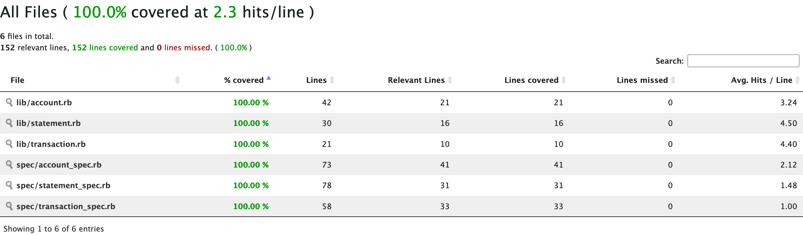
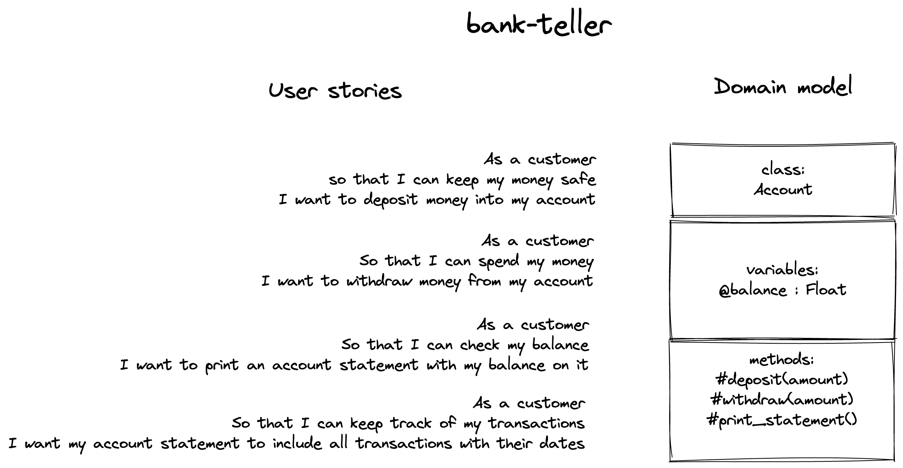
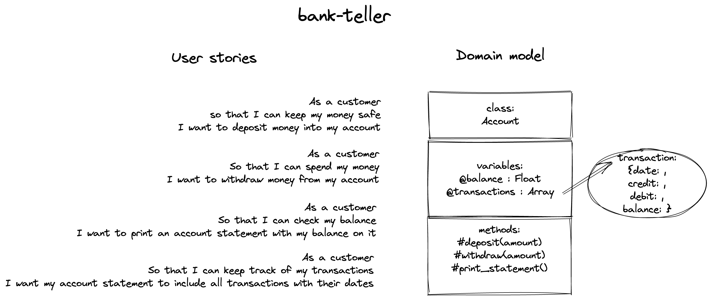
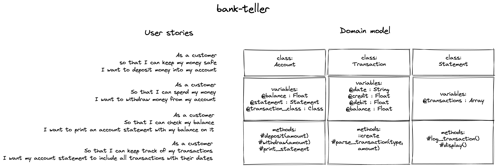

# Bank Teller 

Ruby bank teller program developed to practise doing a tech test. Developed during week 9 of Makers Academy which focuses on code quality.

## Client requirements

* Able to interact with code via a REPL
* Deposits, withdrawals
* Account statement (date, amount, balance) printing
* Data can be kept in memory

### Acceptance criteria

* **Given** a client makes a deposit of 1000 on 10-01-2023
* **And** a deposit of 2000 on 13-01-2023
* **And** a withdrawal of 500 on 14-01-2023
* **When** she prints her bank statement
* **Then** she would see

```
date || credit || debit || balance
14/01/2023 || || 500.00 || 2500.00
13/01/2023 || 2000.00 || || 3000.00
10/01/2023 || 1000.00 || || 1000.00
```

## Test coverage

Generated with `simple-cov`:



## Solution design approach

### 1. User stories

First I unpack the requirements into user stories: 

```
As a customer
so that I can keep my money safe
I want to deposit money into my account

As a customer
So that I can spend my money
I want to withdraw money from my account

As a customer
So that I can check my balance
I want to print an account statement with my balance on it

As a customer
So that I can keep track of my transactions
I want my account statement to include all transactions with their dates
```

### 2. Domain model

Secondly, I use domain modelling to diagram an object-oriented design to deliver the features set out in the user stories. I use Excalidraw as it is uncomplicated with unnecessary features, and creates nice-looking diagrams quickly.



Principles I aim to follow for the design are:
- Keep it super simple (KISS): Avoid unnecessary complexity
- You Ain't Gonna Need It (YAGNI): Do the simplest thing that could possibly work and avoid adding functionality until deemed necessary
- Principle of least astonishment (POLA): A component of a system should behave in a way that most users will expect it to behave.

### 3. Update the domain model

Once I have implemented the `Account` class with `@balance` variable and `#deposit` and `#withdraw` methods, I realise that to store transaction date information I will need to expand my demain beyond my initial design to include a `@transactions` variable - an array that will receive transactions as hashes . Here is my updated design:



### 4. Refactor extracting Transaction and Statement classes

At this point my production code passes the acceptance criteria. I refactor according to the updated design below to ensure single responsibility principle so that:
- Each object does one thing and one thing well



## Code structure

The program is fronted by the `Account` class. The responsibility of this class is to **track balance and handle deposit and withdrawals**. It also holds a statement and provides an option to print the statement, though the engineering of this functionality resides with the statement class.

The `Account` class injects an instance of the `Statement` class on initiation, as well as the `Transaction` class.

The responsibility of the `Transaction` class is to **record transactions* by date, amoubt, type of transaction (credit or debit) and the balance on the account after the transaction.

The responsibility of the `Statement` class is to store transactions and display them in an appropriate form.

### Dependencies

For testing:
* `rspec`
* `simplecov` and `simplecov-console`

For development and testing:
* `rubocop`, `1.20`, using [Makers Academy Scaffolint linter file](https://github.com/makersacademy/scaffolint)

## Usage

### Getting started (installing the code)

Clone the repo locally: `git clone https://github.com/almorcrette/bank-teller`

Install dependencies: `bundle`

### Usage (executing the program)

Use `irb` as follows:
- Start up irb and load the necessary file: `irb -r './lib/account.rb'`
- Create an account to use: `acc = Account.new`

Message the user can use to interact with the account:
- `acc.deposit(amount)` to deposit an amount. e.g. `acc.deposit(100)`
- `acc.withdraw(amount)` to withdraw an amount. e.g. `acc.withdraw(50)`
- `acc.print_statement` to print statement of transactions.

### Running tests

`rspec`

## Potential future extensions
- Program allows an account to become overdrawn (amounts withdrawn exceed amounts deposited). It's not in the client requirements for this feature to be delivered, but this may be a future development that the client want.
- Account does not accrue interest on deposits. This could be another feature to be delivered
- An improved user interface could be developed, e.g. command line or GUI.